# Maison de Luxe POS — System Architecture

**The architecture, the diagrams, and the reasoning behind them.**

This document is the *architecture-level* view of the system: components,
data flow, concurrency & consistency model, security architecture, and
deployment topology. Companion docs:

- [README.md](./README.md) — user-facing feature & setup guide
- [docs.md](./docs.md) — deep technical reference and ops runbook

> **About the diagrams:** each diagram is committed as an **SVG image**
> (`docs/img/`) so it renders in *any* Markdown viewer, with the Mermaid
> source kept in a collapsible block beneath it for editing. Regenerate after
> editing with `npm run render:diagrams`.

---

## 1. Architecture at a Glance

The system is fundamentally a **client-side, offline-first POS** that
synchronizes to a **serverless cloud database**. There is no application
server to operate: the "backend" is Supabase (Postgres + Auth + REST), and the
entire business logic runs in the browser.

<p align="center"></p>

<details>
<summary>Mermaid source (edit, then <code>npm run render:diagrams</code> to refresh the SVG)</summary>

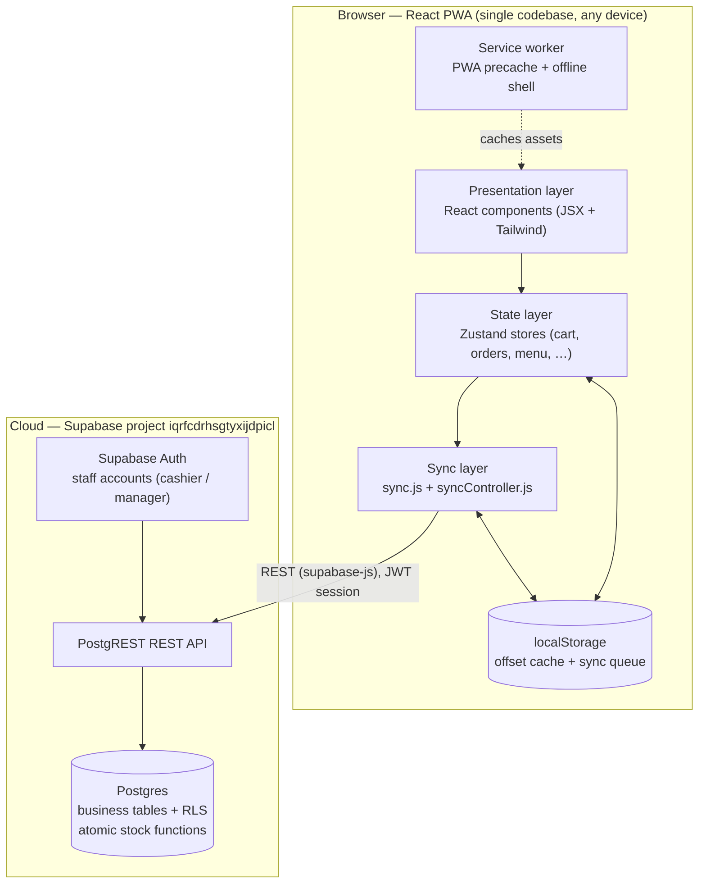

</details>

### Key architectural decisions

| Decision | Why |
|---|---|
| **No custom backend server** | The register must never depend on an in-house server that can go down. Supabase gives Postgres + Auth + REST serverless, always-on, with RLS as the security boundary. |
| **localStorage is the system of record at runtime** | Instant reads/writes → the POS feels native and works airplane-mode. The cloud is the durable, shared source of truth. |
| **Writes go through a queue, never direct** | Turns "the network failed mid-request" into a retryable, durable outbox. |
| **Pull after flush ("remote wins after flush")** | Cleans up convergent multi-register state without ever dropping a locally-unique write. |
| **Stock is owned by the database** | Fixes the silent lost-update oversell bug: the DB serialises movements, so two registers can't both sell the last unit. |
| **PWA shell** | Opens instantly offline after first visit — like a native app on tablets at the counter. |

---

## 2. Component Inventory

```
src/
├── main.jsx / App.jsx      entry; router; role gate; starts sync controller
├── lib/
│   ├── supabase.js         client factory (+ verifyPassword throwaway client)
│   ├── sync.js             queue, enqueue(), flushQueue(), dispatchers
│   └── syncController.js   scheduling: login / online / 30s / ~1.2s queue debounce
├── stores/                 Zustand: cartStore · orderStore · menuStore ·
│                           customerStore · settingsStore · authStore · uiStore
├── pages/                  landing · login · posLayout · adminLayout ·
│                           dashboard · orders · reports · settings · receipt
├── components/             sidebar · invoicePanel · productDetailModal ·
│                           orderDetailsCard · syncStatus · toasts · reportCharts
│   └── settings/           profile · snapshot · reminders · menu mgmt ·
│                           customer directory · manager gate · editor modals
├── utils/                  format · csv · menu · dateRange · validation (×2)
└── data/                   seed menu (48) · customers (15) · add-ons · images
```

---

## 3. Core Flow — Placing an Order (offline-first end to end)

<p align="center">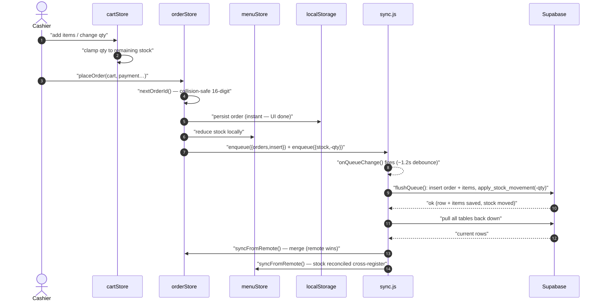</p>

<details>
<summary>Mermaid source (edit, then <code>npm run render:diagrams</code> to refresh the SVG)</summary>

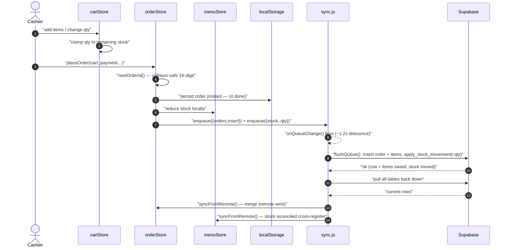

</details>

**Why this ordering matters:** the order id is assigned and the receipt is
painted before any network I/O. If the network is down, steps 8–11 wait; the
queue persists the intent and replays it later. Even a full browser crash
loses nothing newer than the last successful flush.

---

## 4. The Sync Pass (state machine of a connected register)

<p align="center"></p>

<details>
<summary>Mermaid source (edit, then <code>npm run render:diagrams</code> to refresh the SVG)</summary>

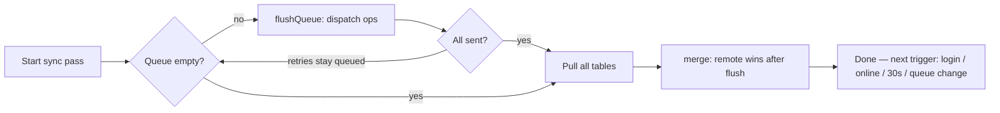

</details>

**Triggers**

| Trigger | Latency target |
|---|---|
| After sign-in | immediate |
| Browser back-online event | immediate |
| Periodic tick (backstop) | every 30 s |
| Any new queued write (`onQueueChange`) | ~1.2 s — this is what makes Register B see Register A's sale within a couple seconds |

**Failure handling:** a failed op stays in the queue (7-day maximum age) but
doesn't block unrelated ops. Independent tables/rows don't depend on each
other, so one bad row can't wedge the register.

---

## 5. Concurrency & Consistency Model

### 5.1 Why registers can't corrupt a shared counter

<p align="center">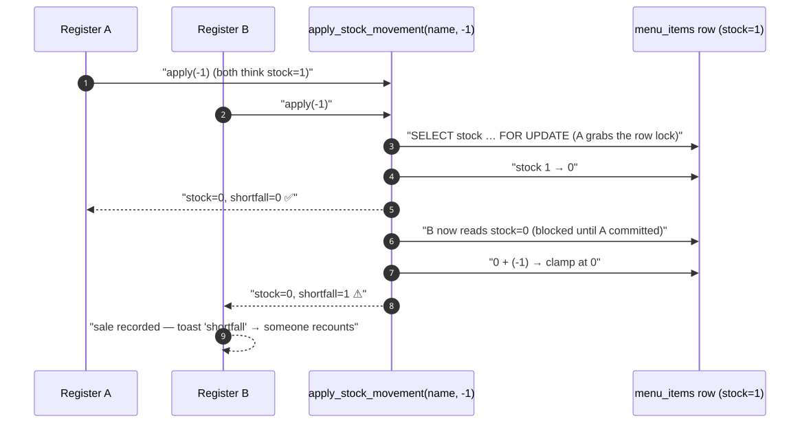</p>

<details>
<summary>Mermaid source (edit, then <code>npm run render:diagrams</code> to refresh the SVG)</summary>

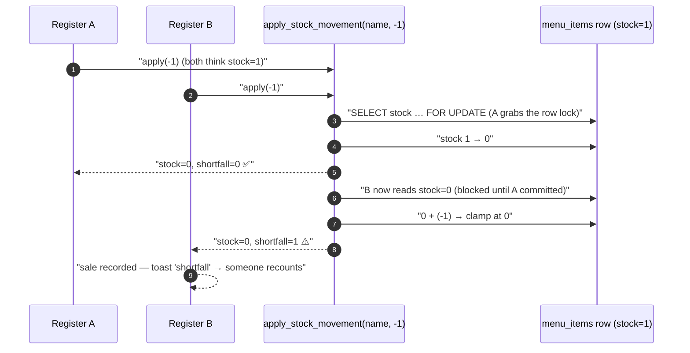

</details>

- The DB serialises concurrent movements with a **row lock**, so the second
  seller is told it "came up short" instead of silently driving the number
  negative.
- The sale still stands (the money changed hands) — the shortfall escalates to
  a human rather than disappearing into whichever register synced last.
- Manager **recounts** use `set_menu_item_stock` (absolute-on-purpose), so an
  explicit count is never confused with a movement.
- Anonymous callers are refused (RLS + `EXECUTE` revoked from `anon`).

### 5.2 Order ID uniqueness

<p align="center"></p>

<details>
<summary>Mermaid source (edit, then <code>npm run render:diagrams</code> to refresh the SVG)</summary>

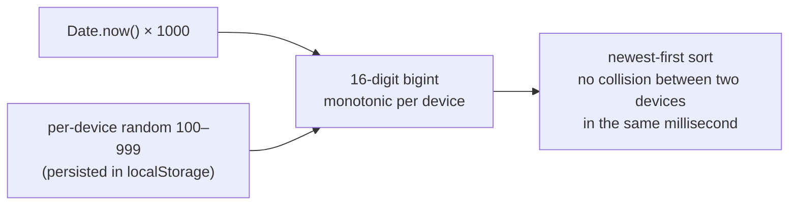

</details>

### 5.3 Conflict resolution

| Conflict | Rule |
|---|---|
| Local order vs remote | Merge by id; remote is authoritative once the queue is flushed |
| Menu item renamed on two devices | Rename dispatcher keeps the new row and cleans up the old; last-flushed wins |
| Same customer name added twice | Unique constraint on `name` → duplicate rejected client-side first |
| Deleted order vs stock | Delete restores stock through `apply_stock_movement(+qty)`; undo re-inserts |

---

## 6. Security Architecture

<p align="center"></p>

<details>
<summary>Mermaid source (edit, then <code>npm run render:diagrams</code> to refresh the SVG)</summary>

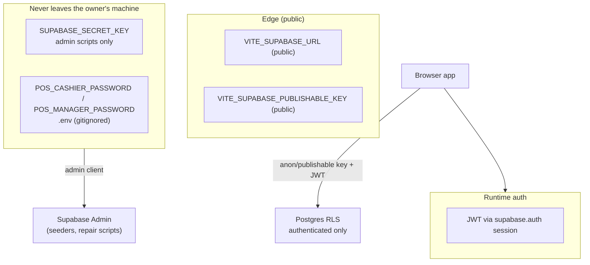

</details>

- **Row Level Security** is the trust boundary: `anon` gets 401/403;
  `authenticated` (a real staff session) can read/write business tables.
- **No hardcoded credentials**: staff passwords live in Supabase Auth; the
  bundle only contains `demo-` prefixed placeholders that pass a guard test
  proving they can never equal a live password.
- **Manager PIN** = the manager's real password, checked through a throwaway
  Supabase client so the cashier's own session is never swapped. There is no
  PIN in the codebase to copy.
- **Database functions are `security invoker`**, so they can't escalate
  privileges beyond the calling role.

---

## 7. Deployment Architecture

<p align="center"></p>

<details>
<summary>Mermaid source (edit, then <code>npm run render:diagrams</code> to refresh the SVG)</summary>

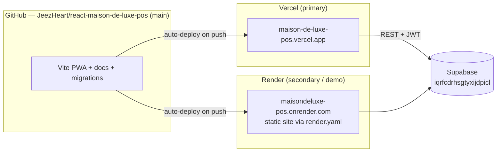

</details>

- Both hosts serve the **same static bundle** — the app is host-agnostic by
  design (PWA + REST). Vercel is primary; Render is a redundant, free,
  always-on demo URL.
- Build-time env vars (public only) are identical on both hosts.
- Render specifics are declared in `render.yaml`: the SPA fallback is a
  blueprint `routes` rewrite (`/* → /index.html`), so deep links work with no
  dashboard setup; the manifest `Content-Type` is a dashboard Custom Header
  rule (or an equivalent blueprint `headers:` block).
- Migrations are applied from the Supabase dashboard (not by the hosts).

---

## 8. Failure & Recovery Model

| Failure | What happens | Recovery |
|---|---|---|
| No internet at the counter | POS fully usable; writes queue locally | Flushes automatically on reconnect |
| Browser crash mid-order | Order + queue persisted in localStorage | Restored on next load; queue replays |
| A queued op keeps failing | Stays queued (7-day TTL), others proceed | Fix cause; it drains on next pass |
| Supabase unavailable | Reads serve from localStorage | N/A — nothing blocking |
| Migration not applied yet | App detects missing function, falls back, warns once | Apply `0003`; restart app |
| Two registers race the last unit | One sale accepted, one shortfall-toast | Recount that item (never audit-holes the sale) |
| Supervisor deletes an order by mistake | Stock restored; 4s Undo toast | Instant undo re-inserts + re-syncs |

---

## 9. Where Each Concern Lives in Code

| Concern | Files |
|---|---|
| Offline-first sync engine | `src/lib/sync.js`, `src/lib/syncController.js` |
| Auth + session + PIN | `src/lib/supabase.js`, `src/stores/authStore.js` |
| Atomic stock decisions | `src/lib/sync.js` dispatchers, `supabase/migrations/0003_atomic_stock.sql` |
| Order identity | `src/stores/orderStore.js` (`nextOrderId`) |
| Business state | `src/stores/*` (Zustand) |
| Money formatting, date parsing, CSV | `src/utils/*` |
| PWA | `vite.config.js` (`vite-plugin-pwa`), `public/` |
| Schema / migrations / RLS | `supabase/migrations/*.sql` |
| QA battery | `tests/`, `scripts/test-sync-flow.mjs`, `scripts/smoke-test.mjs`, `scripts/check-live.mjs` |

---

*Maison de Luxe POS — react Vite PWA + Supabase. Diagrams live as SVG images
(`docs/img/`, regenerated from the Mermaid source above with
`npm run render:diagrams`), so they display in any Markdown viewer.
See README/docs for context.*